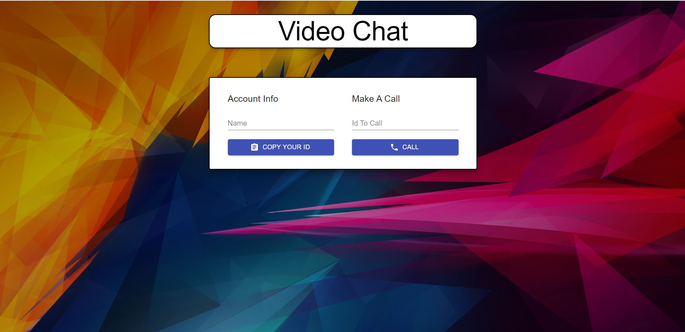

# Video-Chat-App

Image Of The Site

The Site Back Is Developed With Node js(cors,express,socket-io) And The Front Is Developed With React Js (react-copy-to-clipboard,simple-peer,socket.io-client) And The Backend Is Deployed In Herouku And FrontEnd in Netlify

[Link Of The Site](https://apc-video-chat-app.netlify.app/)
